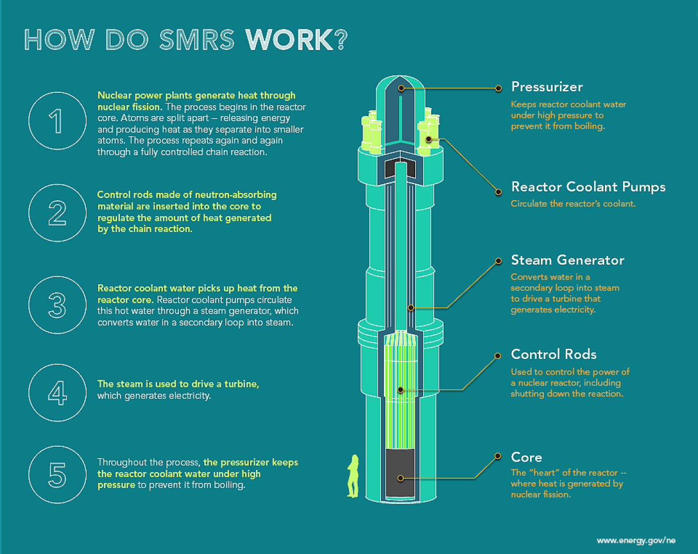

# Instrumentation and Controls

## Challenge Description

Small Modular Reactors (SMRs) are being developed as a new generation of nuclear power plants that can be built in smaller modules, integrated with modern electrical grids, and deployed with advanced safety and monitoring systems. In Canada, SMR development is especially relevant because projects such as the Darlington New Nuclear Project are moving from design and licensing toward construction.

This subchallenge focuses on the instrumentation and controls layer of an SMR-inspired system. Teams can work with a simplified reactor simulation where reactor power, delayed neutron behavior, fuel temperature, coolant temperature, reactivity, and control rod position evolve over time, or approach the challenge in an open-ended, hands-on way.

The goal is not to build a production-grade nuclear mode;, but to build and improve a controller for a nonlinear dynamical system with noisy sensors, potential hidden states, physical constraints, and safety-critical operating limits.

Teams are invited to design control, estimation, fault detection, and visualization features that help the simulated reactor track a requested power output while avoiding unsafe operation.

Below is a chart descrbing how SMRs work:



## Potential Solutions

Teams may approach the challenge in several ways, depending on their background and level of experience:

- Build a [PID](https://www.digikey.de/en/maker/projects/introduction-to-pid-controllers/763a6dca352b4f2ba00adde46445ddeb?srsltid=AfmBOop2VQJangbc5Sx5kFwntYKSpLKkyMPZg2kbVIUl3h992GPeW9hO) (Proportional, Integral, Derivative) controller to help reactor power follow a target value
- Filter noisy sensor readings so the controller receives cleaner data
- Add safety rules for warnings, limits, SCRAM, and shutdown
- Estimate hidden system values such as temperature, reactivity, or sensor bias
- Try advanced controllers such as LQR (Linear-Quadratic Regulator) or MPC (Model Predictive Control)
- Detect problems such as biased sensors, stuck actuators, or unusual temperature behavior
- Test the controller on different scenarios such as power changes, coolant disturbances, sensor noise, and stuck rods
- Build plots or dashboards to show power, temperature, reactivity, rod position, estimates, and safety state
- Tune the system to reduce overshoot, improve tracking, avoid unnecessary shutdowns, and recover from disturbances


### Physical Analogue Solutions

Teams may also build a small physical control system that represents the same core ideas as the reactor simulation: feedback control, noisy sensors, actuator limits, disturbances, safety limits, and fault handling.

Physical systems do not need to resemble a reactor directly. They can act as analogues for a system where a controller must regulate an output while respecting physical constraints.

Possible physical analogue projects include:

* **Temperature control system**
  Use a small fan, low-voltage heater, temperature sensor, and microcontroller to keep a surface, pad, or small enclosure near a target temperature. Teams can also add simple fault cases such as blocked airflow, delayed fan response,     or reduced cooling.
  
  Analogy: reactor power creates heat, coolant or airflow removes heat, and the controller must avoid overheating or trigger a safe shutdown.

* **Closed-loop peristaltic pump flow controller**
  Build a PID-controlled peristaltic pump that regulates water flow through a transparent tube in a closed-loop system. Teams can adjust pump speed to maintain a target flow rate and may add a simple servo-controlled valve or flap to     change the flow resistance.
  
  Analogy: coolant-flow control, disturbance rejection, sensor noise, actuator delay, blocked tubing, bubbles, leaks, or reduced pump performance.

* **Syringe pump dosing controller**  
  Build a PID-controlled syringe pump that dispenses a requested volume of liquid, such as a target number of millilitres over a set time. The actuator could be a stepper motor or servo-driven syringe plunger, and feedback could come     from plunger position, flow measurement, or collected mass/volume.
  
  Analogy: precise setpoint tracking, actuator limits, calibration error, overshoot prevention, and safe shutdown if the pump jams or exceeds limits.

* **Light intensity control system**  
  Use an LED, light sensor, and controller to maintain a target brightness despite ambient light changes.
    
  Analogy: sensor noise, disturbance rejection, and feedback control.

* **Ball-and-beam or balance platform**  
  Use a servo and distance sensor/camera to control the position of a ball or object.
    
  Analogy: unstable or nonlinear dynamics requiring careful controller tuning.

Physical projects should include at least some of the following:

- A measured process variable, such as temperature, speed, level, position, or brightness
- A control input, such as fan speed, motor voltage, pump speed, servo angle, or heater power
- A target setpoint that changes over time
- Sensor noise, delay, or disturbance effects
- Actuator limits or rate limits
- Safety thresholds and shutdown behavior
- Plots, logs, or a dashboard showing system response

For safety, physical builds should use low-voltage components only and avoid unsafe heating, exposed wiring, pressurized systems, mains electricity, open flames, boiling water, or hazardous materials. The goal is to demonstrate instrumentation and control concepts, not to build a high-power device.

## Recommended Roadmap

Teams are encouraged to take the project in any direction. These milestones are not requirements or a scoring checklist; they are simply guides and pathways to help teams in building their solutions.

### Milestone 1: Run the Reactor Simulation

Goal: understand the simplified reactor model and confirm that the starter simulation runs end-to-end.

Suggested outcomes:

- Run the baseline reactor simulation
- Plot reactor power, fuel temperature, coolant temperature, and control rod position
- Identify the available control inputs, sensor outputs, and hidden states
- Test at least one simple scenario, such as a power setpoint change

Good demo: the team can explain how the simulated reactor responds when control rods are inserted or withdrawn.

### Milestone 2: Build a Basic Power Controller

Goal: regulate reactor power using a simple feedback controller.

Suggested outcomes:

- Implement a PID or rule-based controller
- Track a desired power setpoint
- Add actuator limits for rod movement or reactivity commands
- Reduce large overshoot and oscillation during power changes

Good demo: the controller can track a power setpoint change without immediately violating safety limits.

### Milestone 3: Add Safety Logic

Goal: prevent the controller from driving the system into unsafe conditions.

Suggested outcomes:

- Add warning thresholds for fuel temperature, coolant temperature, and reactor power
- Add limiting behavior that overrides aggressive control actions
- Add SCRAM (essentially, an emergency shutdown procedure) for severe violations
- Make safety state visible in logs or the dashboard

Good demo: when a disturbance pushes the reactor toward an unsafe condition, the safety supervisor overrides the controller and moves the system toward a safer state.

### Milestone 4: Improve Instrumentation and State Estimation

Goal: handle noisy and incomplete measurements.

Suggested outcomes:

- Filter noisy sensor readings
- Estimate hidden states such as fuel temperature, precursor concentration, or reactivity bias
- Implement an observer, Kalman filter, or Extended Kalman Filtwer
- Compare true states, measured values, and estimated states in the dashboard

Good demo: the controller performs better when using estimated state information instead of raw noisy measurements alone.

### Milestone 5: Handle Disturbances and Faults

Goal: make the solution robust across multiple operating scenarios.

Suggested outcomes:

- Test load-following scenarios
- Test coolant-flow or heat-removal disturbances
- Test sensor noise, sensor bias, or sensor dropout
- Test actuator faults such as a stuck rod or delayed rod response
- Add fault detection or fallback behavior

Good demo: the controller can recover from at least one nontrivial disturbance without unsafe temperature or power excursions.

### Milestone 6: Make Your Solution Unique

Goal: turn the starter system into your team's own solution.

Possible directions:

- Better control: PID tuning, gain scheduling, LQR, or MPC
- Better estimation: EKF, sensor-fusion, or bias estimation
- Better safety: more robust SCRAM logic, state-machine design, or safety margins
- Better diagnostics: fault detection, fault isolation, alerts, or anomaly scoring
- Better visualization: live plots, scenario replay, controller comparison, or judge-friendly dashboards
- Better evaluation: automated scenario sweeps, score breakdowns, and performance reports

Good demo: the project has a clear idea beyond the starter code and shows why that idea improves reactor control, safety, estimation, or interpretability.

## Physical Analogue Roadmap

Teams building a physical analogue system can follow this general roadmap. These milestones apply to systems such as temperature control, syringe pumps, peristaltic pumps, motor control, water-level control, or light-intensity control.

### Milestone 1: Build and Test the Physical Setup

Goal: confirm that the hardware works and the system can be measured.

Suggested outcomes:

* Connect the sensor, actuator, and microcontroller
* Read the main measured value, such as temperature, flow rate, volume, speed, level, or brightness
* Send simple actuator commands, such as changing pump speed, fan speed, heater power, or motor position
* Log data over time

Good demo: the team can show the sensor reading changing when the actuator is turned on or adjusted.

### Milestone 2: Add Basic Feedback Control

Goal: make the system follow a target value.

Suggested outcomes:

* Define a target setpoint
* Compare the measured value to the target
* Use a PID or rule-based controller to adjust the actuator
* Add basic actuator limits so the system does not command unsafe or impossible values

Good demo: the system moves toward a target value and settles without large oscillations.

### Milestone 3: Add Safety Limits

Goal: prevent the physical system from operating outside safe conditions.

Suggested outcomes:

* Add warning limits for unsafe temperature, flow, pressure, speed, volume, or position
* Stop or limit the actuator if the system approaches an unsafe condition
* Add a simple shutdown state for severe faults
* Make the safety state visible in logs, plots, LEDs, or a dashboard

Good demo: when the system goes outside a safe range, the controller limits or stops the actuator.

### Milestone 4: Improve Measurements

Goal: make the controller work better with real sensor data.

Suggested outcomes:

* Filter noisy sensor readings
* Calibrate the sensor or actuator
* Compare raw readings with filtered readings
* Handle sensor delay, bias, or missing readings

Good demo: the controller behaves more smoothly when using filtered or calibrated measurements.

### Milestone 5: Test Disturbances and Faults

Goal: show that the system can handle real-world problems.

Suggested outcomes:

* Change the setpoint during operation
* Add a disturbance, such as blocked airflow, pinched tubing, bubbles, load change, or ambient light change
* Test sensor noise, sensor bias, or sensor dropout
* Test actuator issues such as a delayed pump, stuck motor, or reduced fan speed
* Add fallback behavior when something goes wrong

Good demo: the system detects or recovers from at least one disturbance without unsafe behavior.

### Milestone 6: Build a Clear Demo

Goal: show what the team built and why it works.

Suggested outcomes:

* Plot target value vs. measured value
* Plot actuator command over time
* Show safety state or fault state over time
* Explain how the controller reacts to disturbances
* Explain how the physical system connects to reactor-control ideas such as feedback, cooling, sensors, actuator limits, and safety logic

Good demo: the team can clearly show the system tracking a target, responding to a disturbance, and staying within safe limits.

## Starter Package Overview

This folder contains starter material for the reactor solution. It is intended as a base package that teams can extend during the event, not as a polished production system or a real reactor safety model.

### Included Components

- `reactor_model.py`  
  Simplified point-kinetics and thermal model for the SMR-inspired reactor simulation.

- `sensor_sim.py`  
  Simulated instrumentation layer that produces noisy measurements of reactor power, temperature, rod position, and other available outputs.

- `controller_base.py`  
  Base controller interface. Teams can implement PID, rule-based logic, LQR, MPC, or their own strategy.

- `ekf_base.py`  
  Optional state-estimation scaffold for teams that want to estimate hidden reactor states from noisy measurements.

- `state_machine.py`  
  Safety supervisor scaffold with states such as NORMAL, WARNING, LIMITING, SCRAM, and SHUTDOWN.

- `scenarios.py`  
  Scenario definitions for load changes, coolant disturbances, sensor faults, actuator faults, and other test cases.

- `evaluator.py`  
  Scoring logic for power tracking, safety-limit violations, control smoothness, disturbance recovery, and unnecessary shutdowns.

- `dashboard.py`  
  Visualization tools for plotting reactor power, temperature, control inputs, estimated states, safety state, and score.

- `requirements.txt`  
  Python package dependencies for running the simulator, controller, evaluator, and dashboard.

## Development Setup

### Python Environment

The starter code expects a local Python environment with the packages listed in `requirements.txt`.

Suggested setup:

1. Create a virtual environment
2. Install the requirements
3. Run a baseline scenario
4. Inspect plots or dashboard output
5. Modify the controller, estimator, or safety supervisor

Example workflow:

```bash
python -m venv .venv
source .venv/bin/activate      # macOS / Linux
# .venv\Scripts\activate       # Windows PowerShell
pip install -r requirements.txt
```

### Running the Simulation

Example commands may look like:

```bash
python run_scenario.py --scenario load_step
python run_scenario.py --scenario coolant_disturbance
python run_scenario.py --scenario sensor_bias
```

If a dashboard is provided:

```bash
python dashboard.py
```

Exact commands may change as the starter package evolves.

## Scoring Ideas

The evaluator may score solutions using a combination of:

- Power tracking accuracy
- Fuel and coolant temperature safety
- Avoidance of severe safety violations
- Smoothness of rod or reactivity commands
- Recovery after disturbances
- Robustness across hidden scenarios
- Accuracy of state estimates
- Avoidance of unnecessary SCRAM events
- Quality of visualization or interpretability

A strong solution should not only track power well, but also behave safely when sensors are noisy, disturbances occur, or the model enters an abnormal state.

## Notes for Teams

- This is an educational simulation challenge, not a real nuclear reactor control system.
- The reactor model is intentionally simplified so teams can focus on controls, instrumentation, estimation, and safety logic.
- The best first step is usually a stable PID controller with clear safety overrides.
- More advanced methods such as EKF, LQR, and MPC are encouraged but not required for a working solution.
- Safety logic should be treated as a separate layer from the nominal controller.
- Good engineering judgment matters: avoid overfitting to one scenario and test across multiple disturbances.
- Document your assumptions, tuning choices, and failure modes so judges can understand your design.

## Background References

Suggested background topics:

- Canadian Small Modular Reactor Roadmap and SMR Action Plan
- Darlington New Nuclear Project
- GE Vernova Hitachi BWRX-300
- Reactor point kinetics
- PID control
- State-space control
- Kalman filtering and nonlinear state estimation
- Model predictive control
- Fault detection and isolation
