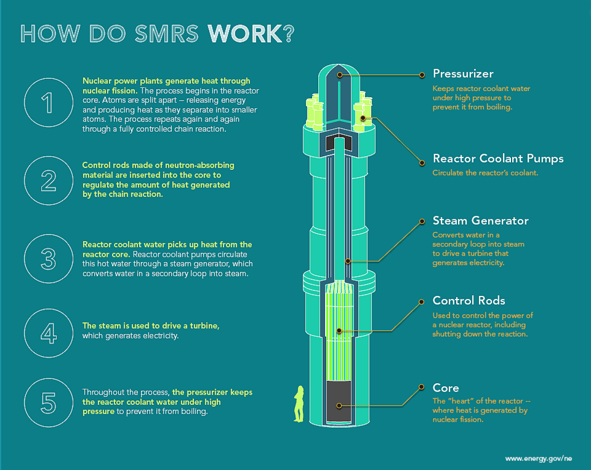

# Instrumentation and Controls

Small Modular Reactors (SMRs) are being developed as a new generation of nuclear power plants that can be built as compact devices with advanced safety and monitoring systems. In Canada, SMR development is especially relevant because projects such as the Darlington New Nuclear Project are moving from design and planning toward construction.

This subchallenge focuses on the instrumentation and controls layer of an SMR-inspired system: building and improving a controller for a nonlinear dynamical system with noisy sensors, potential hidden states, physical constraints, and safety-critical operating limits.

Below is a chart describing how SMRs work:

---

## Table of Contents

- [Challenge](#challenge)
- [Two Approaches](#two-approaches)
- [Potential Solutions](#potential-solutions)
- [Repository Layout](#repository-layout)
- [Things to Keep in Mind](#things-to-keep-in-mind)
- [Notes for Teams](#notes-for-teams)
- [Resources](#resources)

---

## Challenge

Your goal is to develop a control and instrumentation system for a simulated reactor or an analogous physical system at a requested output while keeping it safe when sensors are noisy, disturbances hit, and components fail.

Successful solutions should consider:

- Tracking a setpoint that changes over time, without large overshoot or oscillation
- Staying inside safety limits, and shutting down cleanly when they are threatened
- Behaving sensibly when a sensor is noisy, biased, or dead, and when an actuator sticks or lags

Teams are encouraged to explore solutions such as:

- Software applications
- Hardware prototypes
- Data analysis approaches
- Optimization methods
- Research-based solutions

Solutions should consider:

- Feasibility
- Scalability
- User impact
- Sustainability
- Technical implementation

---

## Two Approaches

Teams can approach this challenge from scratch or from either (or both) of two supported directions:

- **Simulated reactor track**: work with a simplified reactor model where reactor power, delayed neutron behavior, fuel temperature, coolant temperature, reactivity, and control rod position evolve over time. See [`reactor_control/README.md`](reactor_control/README.md) for the code, how to run it, and a roadmap.

- **Physical analogue track**: build a small hands-on control system that represents the same core ideas (feedback control, noisy sensors, actuator limits, disturbances, safety limits, fault handling) without needing to resemble a reactor directly. See [`Physical Systems/README.md`](Physical%20Systems/README.md) for the existing example builds, wiring reference, and a roadmap.

Both tracks are invited to design control, estimation, fault detection, and visualization features that help their system track a requested setpoint while avoiding unsafe operation.

Physical systems do not need to resemble a reactor directly, they act as analogues for any system where a controller must regulate an output while respecting physical constraints. Two example builds (dye concentration control, temperature control) already exist in [`Physical Systems/`](Physical%20Systems/) as a starting point, but teams are free to build a different analogue.

---

## Potential Solutions

The ideas below are examples to help teams explore possible directions. They are not the only possible solutions.

Teams are encouraged to combine ideas, explore new approaches, and develop creative solutions.

| Potential Solution | Description | Resources |
| --- | --- | --- |
| **PID (Proportional Integral Derivative) control** | Build and tune a PID controller so the system tracks its target with minimal overshoot and settles quickly. The usual first win, and the baseline everything else is measured against. | [Intro to PID](https://www.digikey.de/en/maker/projects/introduction-to-pid-controllers/763a6dca352b4f2ba00adde46445ddeb), [How to tune a PID controller](https://www.digikey.com/en/maker/projects/how-to-tune-a-pid-controller/9ee9a111aef049af9f84f785779989ec) |
| **Filtering and state estimation** | Clean up noisy sensor readings before the controller sees them, and estimate values you cannot measure directly, such as temperature, reactivity, or sensor bias. Ranges from a moving average to a full Kalman or extended Kalman filter. | [How a Kalman Filter Works, in Pictures](https://www.bzarg.com/p/how-a-kalman-filter-works-in-pictures/) |
| **Safety supervision** | Add a layer above the controller that watches for unsafe conditions and overrides commands warnings, limiting, SCRAM, and a shutdown that latches until deliberately reset. | [Reactor protection system](https://en.wikipedia.org/wiki/Reactor_protection_system) |
| **Fault detection and isolation** | Notice when a sensor is drifting, stuck, or dead, or when an actuator is not doing what it was told — then say *which* one, and fall back safely. | [Fault detection and isolation](https://en.wikipedia.org/wiki/Fault_detection_and_isolation) |
| **Advanced control** | Go beyond PID with gain scheduling, a linear-quadratic regulator, or model predictive control that plans ahead against known constraints. | [LQR](https://en.wikipedia.org/wiki/Linear%E2%80%93quadratic_regulator), [MPC](https://en.wikipedia.org/wiki/Model_predictive_control) |
| **Testing across scenarios** | Exercise the controller against setpoint changes, disturbances, sensor noise, and actuator faults, and show it holds up rather than being tuned for one happy path. | [`reactor_control/scenarios.py`](reactor_control/scenarios.py) |
| **Visualization and evaluation** | Build dashboards, live plots, scenario replays, or an automated scoring sweep that compares two controllers across every test case. | [Matplotlib](https://matplotlib.org/stable/index.html), [Plotly Dash](https://dash.plotly.com/) |
| **Physical analogue build** | A temperature control system, and dye concentration system demonstrating the same feedback, noise, limits, and safety ideas in hardware. | [`Physical Systems/`](Physical%20Systems/) |

---

## Repository Layout

- [`reactor_control/`](reactor_control/) : the simulated-reactor track: reactor model, sensors, PID controller, EKF, safety state machine, named scenarios, and a CLI runner. See its README for details and the roadmap.
- [`Physical Systems/`](Physical%20Systems/) : the physical-analogue track: Arduino sketches for a dye-concentration loop and a temperature-control loop, plus a wiring reference. See its README for details and the roadmap.

---

## Things to Keep in Mind

- Setpoint tracking accuracy
- Safety-margin adherence (e.g. temperature, power, or flow limits)
- Avoidance of severe safety violations
- Smoothness of actuator commands
- Recovery after disturbances
- Robustness across hidden or varied scenarios
- Accuracy of state estimates
- Avoidance of unnecessary shutdowns
- Quality of visualization or interpretability

A strong solution should not only track its setpoint well, but also behave safely when sensors are noisy, disturbances occur, or the system enters an abnormal state.

---

## Notes for Teams

- This is an educational challenge, not a real nuclear reactor control system.
- The reactor model is intentionally simplified so teams can focus on controls, instrumentation, estimation, and safety logic.
- The best first step is usually a stable PID controller with clear safety overrides.
- More advanced methods such as EKF, LQR, and MPC are encouraged but not required for a working solution.
- Safety logic should be treated as a separate layer from the nominal controller.
- Good engineering judgment matters: avoid overfitting to one scenario and test across multiple disturbances.
- Document your assumptions, tuning choices, and failure modes so judges can understand your design.

---

## Resources

The following resources may help teams better understand the problem and develop solutions.

### Background Information

- [Canadian SMR Action Plan](https://smractionplan.ca/): national context for why SMRs matter in Canada.
- [Darlington New Nuclear Project](https://www.opg.com/powering-ontario/our-generation/nuclear/darlington-new-nuclear-project/): the Ontario build moving from design into construction.
- [GE Vernova Hitachi BWRX-300](https://www.gevernova.com/nuclear/carbon-free-power/bwrx-300-small-modular-reactor): the SMR design being deployed at Darlington.
- [Point Kinetics Equations](https://www.nuclear-power.com/nuclear-power/reactor-physics/reactor-dynamics/point-kinetics-equations/): the reactor-physics model behind the simulated track.

### Technical Resources

- [Introduction to PID Controllers](https://www.digikey.de/en/maker/projects/introduction-to-pid-controllers/763a6dca352b4f2ba00adde46445ddeb): what the three terms actually do.
- [How to Tune a PID Controller](https://www.digikey.com/en/maker/projects/how-to-tune-a-pid-controller/9ee9a111aef049af9f84f785779989ec): a practical tuning procedure to work through.
- [How a Kalman Filter Works, in Pictures](https://www.bzarg.com/p/how-a-kalman-filter-works-in-pictures/): the clearest visual introduction to filtering and state estimation.
- [SciPy documentation](https://docs.scipy.org/doc/scipy/): ODE integration and linear algebra used by the simulated track.
- [Matplotlib documentation](https://matplotlib.org/stable/index.html): plotting and dashboards.
- [Arduino reference](https://www.arduino.cc/reference/en/): for the physical analogue track.

### Data Sources

- No external dataset is required. The simulated track generates its own data through [`reactor_control/scenarios.py`](reactor_control/scenarios.py); the physical track produces data from your own hardware.

### Additional References

- [Reactor Dynamics](https://www.nuclear-power.com/nuclear-power/reactor-physics/reactor-dynamics/): reactivity, feedback, and transient behaviour.
- [State-space representation](https://en.wikipedia.org/wiki/State-space_representation): the framework underneath LQR and Kalman filtering.
- [Model Predictive Control](https://en.wikipedia.org/wiki/Model_predictive_control): planning control actions against explicit constraints.
- [Fault detection and isolation](https://en.wikipedia.org/wiki/Fault_detection_and_isolation): detecting and diagnosing sensor and actuator faults.
