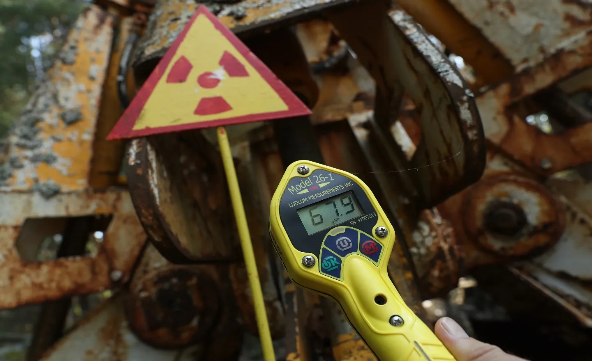

# Leak Detection and Cleanup



## Challenge Description

Leak detection is an important part of safe nuclear facility operation because abnormal releases can affect containment, operating conditions, and response actions. Small Modular Reactors (SMRs) present unique detection challenges due to their compact form factor, novel geometries, and distributed deployment scenarios compared to traditional large reactors.

This subchallenge invites students to develop autonomous systems capable of detecting, localizing, and reporting abnormal leakage conditions in SMR facilities. Students should consider different leak types when designing their solutions; examples include process-system leaks such as a primary heat transport system (PHTS) leak and failed-fuel scenarios where fission products enter the heat transport system. Solutions may also address monitoring contamination spread and supporting cleanup operations through robotics, sensor networks, data analysis, and machine learning techniques.

Students are encouraged to explore how modern sensor technology, AI, robotics, and simulation can be integrated to reason about leak detection and response in real-world nuclear facility challenges.

## Ways to Approach This Challenge

This challenge is designed to accommodate diverse technical backgrounds. Teams may select one of the following paths or integrate elements from both approaches.

### Science Path
Focus on understanding the physics of radiation detection and developing methods to find where leaks come from.

Possible directions:
- Study how radiation travels through a facility and how sensors detect it across different leak scenarios
- Develop algorithms to pinpoint leak locations using multiple sensor readings (triangulation and source identification)
- Analyze sensor data to understand normal facility operations versus leak scenarios
- Research how different sensor types respond to radiation and what makes them accurate or unreliable
- Create a proposal for the best sensor placement strategy in a facility
- Explore how to reduce false alarms while catching real leaks


### Software Path
Focus on building tools, dashboards, and automated systems that help detect and respond to leaks.

Possible directions:
- Build machine learning models that learn to recognize leak patterns from historical data
- Create a user-friendly dashboard that displays real-time sensor information and leak alerts
- Develop algorithms that help robots or drones navigate a facility efficiently to search for leaks
- Design a system that automatically flags suspicious sensor readings and alerts operators
- Build data processing pipelines that clean messy sensor data and prepare it for analysis
- Create visualization tools that show where a leak might be located based on sensor readings
- Automate the comparison and ranking of different detection strategies

## Available Resources

This repository includes three example areas that students may explore when thinking about a solution. They are not meant to be exhaustive, and students are welcome to pursue other ideas that fit the challenge:

### 1. Sensor Localization Tools
Located in [sensor_localization/](/Leak%20Detection%20and%20Cleanup/sensor_localization/), algorithms and calibration data for source identification on a physical system:
- Multi-point sensor measurements from various facility locations
- Calibration profiles at multiple intensity levels (0-100%)
- Triangulation and signal fusion methods for source estimation
- Reference validation datasets with known leak locations

**Potential applications:**
- Enhance localization accuracy through algorithmic improvements
- Optimize sensor placement for maximum spatial coverage
- Validate source identification against ground-truth locations
- Extend methods to new facility configurations and sensor types

### 2. Machine Learning Framework
Located in [machine_learning/](/Leak%20Detection%20and%20Cleanup/machine_learning/), a Jupyter notebook environment with preprocessed datasets:
- Time-series sensor data from normal operations and known leak events
- Data preprocessing and feature extraction pipelines
- Baseline neural network models and evaluation metrics
- Classification framework for distinguishing operational states

**Potential applications:**
- Develop and tune leak detection classifiers
- Perform comparative analysis across model architectures
- Evaluate generalization performance on held-out data
- Integrate trained models into real-time detection systems

### 3. 3D Simulation Environment
Located in [leak-detection-simulation/](/Leak%20Detection%20and%20Cleanup/leak-detection-simulation/), a Godot-based virtual facility that enables:
- Spatial modeling of facility layout and containment structures
- Autonomous robotic agent control and navigation
- Real-time sensor visualization and contamination spread simulation
- Scenario-based testing with configurable leak events

**Potential applications:**
- Validate detection and localization algorithms against simulated scenarios
- Evaluate robot patrol strategies and coverage efficiency
- Test system behavior across different facility geometries
- Integrate external detection models with robotic navigation

## Suggested Workflow

This is an open-ended subproblem, so students can approach it from whatever direction best fits their interests, background, and solution idea. A practical way to get started is to:

1. **Start from your idea**: Decide what kind of leak-detection or response problem you want to solve and what a useful solution would look like. The available resources are a good starting point.
2. **Explore supporting resources**: Use whichever files, tools, datasets, or simulation assets help you develop that idea.
3. **Shape the solution**: Clarify the assumptions, outputs, and level of detail that make sense for your approach.
4. **Build an initial version**: Create a simple first pass that helps you test the core concept.
5. **Iterate and expand**: Improve the approach, compare alternatives, and add complexity where it strengthens the solution.
6. **Combine directions if useful**: If your idea spans multiple areas, connect the relevant pieces into one workflow.
7. **Document your thinking**: Explain the approach, results, and limitations so others can follow your reasoning.

## Environment & Materials

### Workspace File Structure
```
Leak Detection and Cleanup/
├── README.md                           # This file
├── leak-detection-simulation/          # Godot 3D environment
│   ├── project.godot                   # Godot project configuration
│   ├── *.tscn                          # 3D scenes (world, rooms, drone, etc.)
│   ├── *.gd                            # GDScript behavior and control logic
│   ├── shaders/                        # Custom shaders (water, fog, etc.)
│   └── scripts/                        # GDScript utilities
├── machine_learning/                   # ML model training and evaluation
│   └── LeakDetection.ipynb             # Jupyter notebook for leak classification
└── sensor_localization/                # Sensor reading and leak localization
    ├── read_sensors/                   # Raw sensor data acquisition
    └── sensor_location/                # Localization algorithms and calibration
        └── calibration/                # Calibration profiles (0-100%)
```

### Technology Stack
- **3D Simulation**: Godot Engine 4.4+
- **Machine Learning**: TensorFlow/Keras, scikit-learn, NumPy, Pandas
- **Data Processing**: Python, Jupyter Notebook
- **Robotics/Navigation**: GDScript (Godot), potentially ROS for advanced teams

### Dependencies
- Godot Engine (for simulation)
- Python 3.8+
- TensorFlow, scikit-learn, joblib, pandas, numpy (for ML)
- Jupyter Notebook (for interactive development)

## Getting Started

1. **Review project scope**: Examine this README and the main workspace README to understand the challenge objectives and available resources.
2. **Familiarize with simulation**: Launch the Godot project and observe facility geometry, environmental effects, and robot capabilities.
3. **Examine sensor data**: Review the machine learning notebook to understand data formats, operational signatures, and leak event characteristics.
4. **Understand localization methods**: Study the sensor localization code and calibration data to learn source identification techniques.
5. **Select a direction**: Decide which resource or combination of resources best fits the solution you want to build.
6. **Begin implementation**: Start with a focused technical area and progressively integrate components into a cohesive solution.

