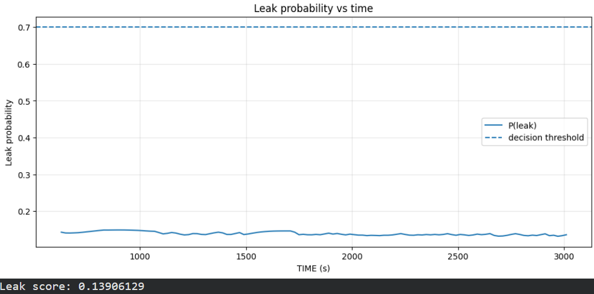
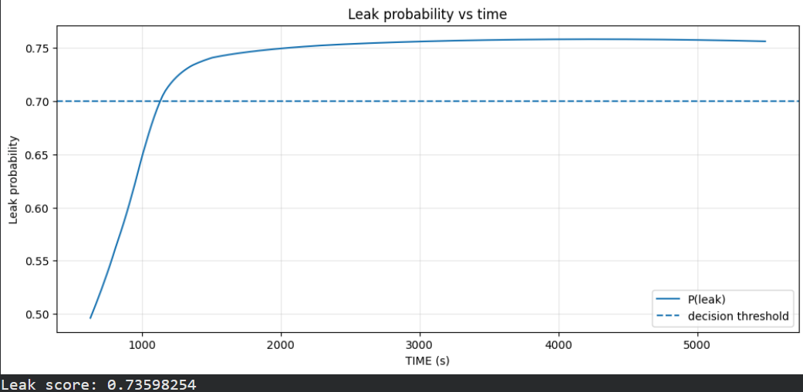
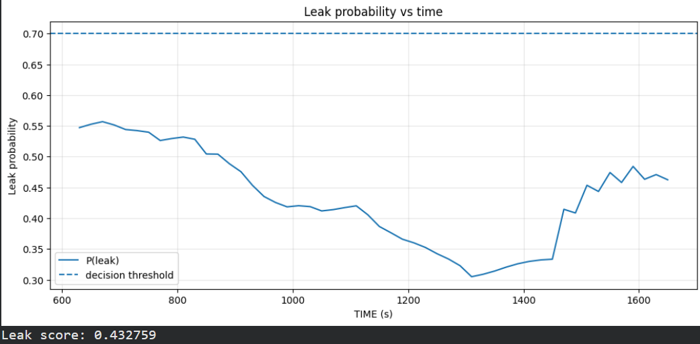
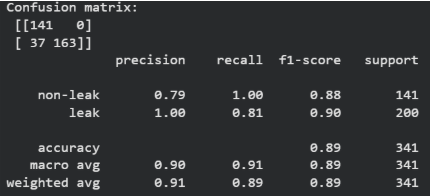
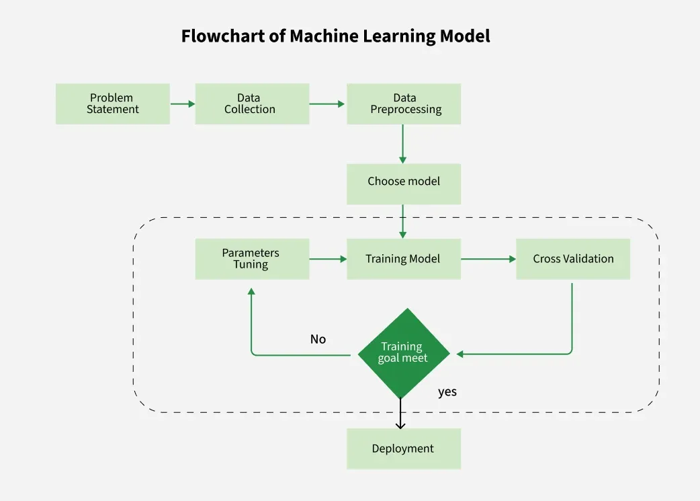
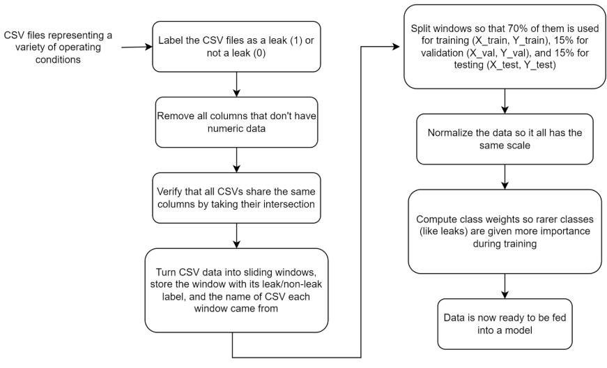

# Machine Learning Leak Detection Challenge

Welcome to the Machine Learning Leak Detection Challenge. This repository provides a baseline Supervised Long Short-Term Memory (LSTM) neural network designed to predict leak probabilities from sequential plant sensor data.

The baseline system classifies operational states into normal operation, leak conditions, and non-leak anomalies or accident scenarios. A decision threshold of 70% probability is used to flag a leak event.

---

## Setup and Execution Guide

Follow these steps to set up the environment and run the notebook in Google Colab:

### Step 1: Notebook Initialization
1. Open [Google Colab](https://colab.research.google.com/).
2. Select **File > Open notebook** (`Ctrl + O`) and upload [`LeakDetection.ipynb`](LeakDetection.ipynb).

### Step 2: Repository Setup
1. Open the Colab Command Palette (`Tools > Command Palette` or `Ctrl + Shift + P`).
2. Search for **terminal** and select **Show Terminal**.
3. Execute the following commands in the terminal:
   ```bash
   git clone https://github.com/thu-inet/NuclearPowerPlantAccidentData
   cd NuclearPowerPlantAccidentData/
   ```

### Step 3: Dependency Configuration
1. Open the **Files** sidebar (sixth icon from the top on the left sidebar).
2. Navigate to `NuclearPowerPlantAccidentData/` and open `requirements.txt`.
3. Replace `~=` with `>=` in the first three lines.
4. Change the fourth line to `torch`.
5. Save the file (`Ctrl + S`)
6. Install the updated requirements in the terminal:
   ```bash
   pip install -r requirements.txt
   ```
   *If installation errors occur, run:*
   ```bash
   pip install -r requirements.txt --index-url https://pypi.org/simple --extra-index-url https://pytorch.org
   ```

### Step 4: Training and Inference
1. **Training Cell (Cell 1):** Generates model weights and outputs initial evaluation metrics.
2. **Inference Cell (Cell 2):** Runs predictions on input sequence files and plots leak probability over time.

---

## Working with Althernative Data

* **Changing Operational Scenarios:**
  * Scenario files are located in `NuclearPowerPlantAccidentData/Operation_csv_data/`.
  * Update file references in the `runs` list within Cell 1 to train on different accident types.
  * In Cell 2, modify the dataset path passed to `run_leak_detection()` (e.g., `run_leak_detection(f"{BASE_DIR}LOCA/1.csv")`).
* **Custom Datasets:**
  * Upload custom CSV files via the Colab File Explorer.
  * Ensure `BASE_DIR` paths match the target dataset folder structure.

---

## Project Overview

This repository serves as the starting template for your solution. You are provided with a functional baseline pipeline, but you are encouraged to refine, optimize, or completely replace the architecture.

### Extension Ideas
* **Model Architecture:** Experiment with GRUs, Bidirectional LSTMs, Transformers, or ensemble methods.
* **Multi-Class Classification:** Extend predictions to estimate leak severity levels or flow rates.
* **Real-Time Data Pipeline:** Implement a dynamic pipeline to ingest continuous data streams and display real-time predictions.
* **Dataset Exploration:** Benchmark performance using alternative time-series datasets or synthetic noise profiles.
* **Default Benchmark Dataset:** [NuclearPowerPlantAccidentData (NPPAD)](https://github.com/thu-inet/NuclearPowerPlantAccidentData).

---

## Baseline System Output

The output graphs below illustrate model performance across three primary operating scenarios:

### Normal Operation
Under standard operating conditions, the predicted leak probability remains well below the 70% decision threshold.



### Leak Condition (e.g., Steam Generator Tube Rupture)
When a leak occurs, the predicted probability rapidly exceeds the 70% threshold, successfully triggering an alert.



### Non-Leak Anomaly (e.g., Control Rod Withdrawal)
During non-leak operational anomalies, predicted probability fluctuates but stays under the threshold, avoiding false alarms.



---

## Model Evaluation

The training cell outputs performance metrics and confusion matrix:



The first two rows, [141 0] and [37 163], denote:  
* 141 correctly predicted non-leaks 
* 0 predicted leak, but actually a non-leak (no false positives) 
* 37 missed leaks (predicted non-leak but actually a leak) (false negatives) 
* 163 correctly predicted non-leaks 

In the table it has the columns: precision, recall, f1-score, and support. The easiest way to understand this is to walk through it:  
* **Non-leaks:** correct 79% of the time, 0 false positives, 88% accuracy  
* **Leaks:** correct 100% of the time (every leak predicted is a leak), 81% false negatives, 90% accuracy 
* Overall scores: 
    * 89% accuracy 
    * All the numbers (macro avg) are similar means that the model treats both classes equally 
    * All the numbers (weighted avg) are similar means that the model treats both classes equally 

---

## Pipeline & Architecture Overview

### Machine Learning Workflow
The end-to-end workflow follows standard operational stages:



1. **Problem Statement:** Binary classification of multi-sensor time-series sequences.
2. **Data Collection:** Reading raw CSV files containing operational readings.
3. **Data Preprocessing:** Feature selection, sliding window generation, train/val/test splits, normalization, and class weighting.
4. **Choose Model and Model Training:** Training sequential layers with validation tracking.
5. **Deployment:** Exporting serialized model assets and plotting continuous probabilities over time.

### Model Architecture
The baseline architecture is built using sequential layers:

1. **Input Layer:** Accepts input shapes defined by `(window_size, num_features)`.
2. **LSTM Layer:** Extracts temporal feature representations from sequential sensor streams.
3. **Dropout Layer:** Mitigates overfitting by dropping units during training.
4. **Dense Layer:** Outputs scalar leak probability values.

*Resource:* [Keras Layers Overview](https://keras.io/api/layers/)

---

## Data Preprocessing Pipeline

Proper sequence preprocessing is required before training:



*Resources:*
* [Sliding Window Method in Time Series Analysis](https://lazyprogrammer.me/what-is-the-sliding-window-method-in-time-series-analysis/)
* [Scikit-learn Train Test Split Documentation](https://scikit-learn.org/stable/modules/generated/sklearn.model_selection.train_test_split.html)

---

## Technical Reference & Dependencies

### Core Technical Concepts
* **Supervised Learning:** The model trains on labeled sensor sequences (`1` for leak, `0` for non-leak).
  * Resource: [GeeksForGeeks: Supervised and Unsupervised Learning](https://www.geeksforgeeks.org/supervised-unsupervised-learning/)
* **RNNs and LSTMs:** Recurrent Neural Networks and Long Short-Term Memory units handle temporal dependencies across sequential data.
  * Resource: [IBM: Recurrent Neural Networks (RNN)](https://www.ibm.com/topics/recurrent-neural-networks)
* **TensorFlow / Keras:**
  * Resource: [TensorFlow Recurrent Neural Network Guide](https://www.tensorflow.org/guide/keras/rnn)

### Tech Stack & Dependencies
* **Execution Platform:** Google Colab (recommended for GPU runtime and standard dependencies)
* **Required Libraries:**
  * `numpy`: Array manipulation
  * `pandas`: CSV data handling and feature extraction
  * `joblib`: Model artifact serialization
  * `scikit-learn`: Feature scaling (`StandardScaler`), class weighting (`compute_class_weight`), and evaluation metrics
    * Resource: [Scikit-learn Documentation](https://scikit-learn.org/stable/)
  * `tensorflow` / `keras`: Neural network construction and training
    * Resource: [TensorFlow API Documentation](https://www.tensorflow.org/api_docs)