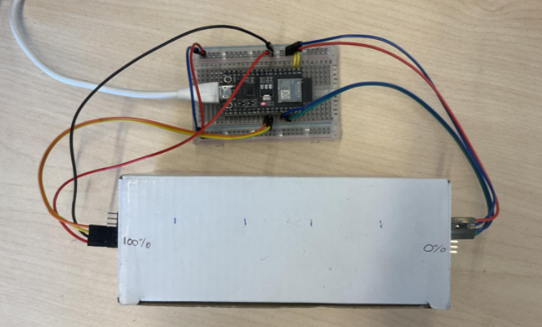
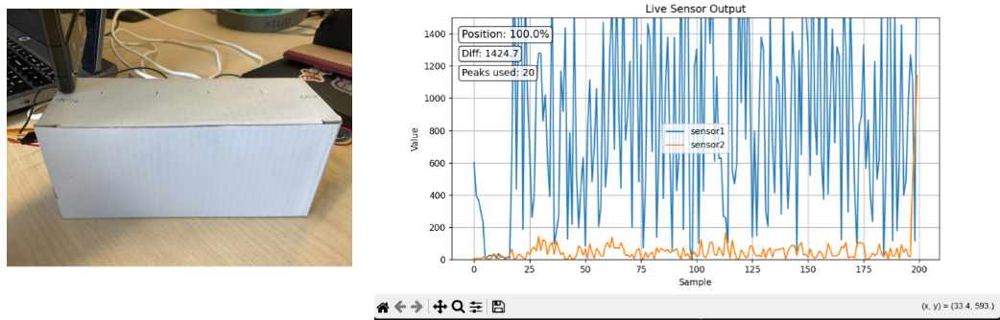
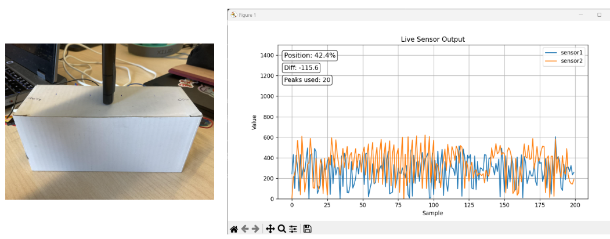
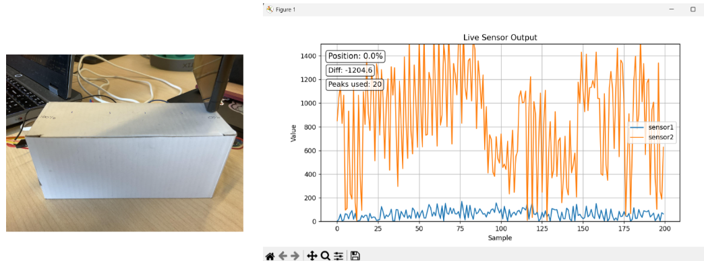

# Sensor Localization Challenge

Welcome to the Sensor Localization Challenge. This repository provides a baseline hardware and software setup designed to estimate the position of a localized vibration source (such as a leak) along a physical structure using accelerometer sensors and real-time signal processing.

The baseline implementation reads acceleration data from two BMX160 sensors connected to an ESP32 microcontroller, calculates instantaneous vibration magnitudes relative to a rolling baseline, streams the data over serial to a host machine, and estimates the relative position percentage using peak selection and linear interpolation.

---

## Setup and Execution Guide

Follow these steps to configure the hardware, upload the firmware, and run the real-time Python localization dashboard:

### Step 1: Hardware Wiring and Connections



The system uses two separate I2C hardware buses on an ESP32 microcontroller to read two BMX160 sensors sharing the same default I2C address (`0x68`):

| Sensor | ESP32 Bus | SDA Pin | SCL Pin | Clock Speed | I2C Address |
| :--- | :--- | :--- | :--- | :--- | :--- |
| **Sensor 1 (Left)** | `I2C_1` (Bus 0) | GPIO 21 | GPIO 22 | 400 kHz | `0x68` |
| **Sensor 2 (Right)** | `I2C_2` (Bus 1) | GPIO 18 | GPIO 23 | 400 kHz | `0x68` |

Connect VCC to 3.3V and GND to common ground on the microcontroller.

### Step 2: Firmware Compilation and Upload
1. Open **Arduino IDE**.
2. Set the board to **ESP32 Dev Module** under **Tools > Board**.
3. Install required Arduino libraries via the Library Manager (`Ctrl + Shift + I`):
   * `RunningAverage` (by Rob Tillaart)
   * `Wire` (Standard ESP32 library)
4. Open [`read_sensors/accelerometer/accelerometer.ino`](read_sensors/accelerometer/accelerometer.ino). Ensure [`Bmx160Raw.h`](read_sensors/accelerometer/Bmx160Raw.h) and [`Bmx160Raw.cpp`](read_sensors/accelerometer/Bmx160Raw.cpp) are in the same directory.
5. Connect the ESP32 via USB, select the correct port in **Tools > Port**, and upload the sketch.
6. Open the Serial Monitor at **115200 baud** to verify sensor initialization (`Sensor1: OK`, `Sensor2: OK`).

### Step 3: Python Environment Setup
Install the necessary Python packages on your host system:

```bash
pip install pyserial numpy matplotlib
```

### Step 4: Launch Real-Time Localization

1. Open [`sensor_location/sensor_location.py`](sensor_location/sensor_location.py).
2. Set the `PORT` variable to match your connected serial port (e.g., `PORT = "COM11"` on Windows or `/dev/ttyUSB0` on Linux/macOS).
3. Run the tracking script from the sensor_localization folder:
```bash
python sensor_location/sensor_location.py
```
4. A live Matplotlib interface will display real-time sensor amplitude streams, calculated differential values, peak usage statistics, and the estimated position percentage.

---

## Calibration and Threshold Configuration

Before collecting evaluation measurements, calibrate the system for your specific test rig and vibration source:

### 1. Noise Floor Threshold (`NO_VIB_THRESHOLD`)

* Observe raw sensor outputs when no vibration is present.
* Update `NO_VIB_THRESHOLD = 70` in [`sensor_location.py`](sensor_location/sensor_location.py). Samples where combined signal strength (`sensor1 + sensor2`) falls below this value are discarded as background noise.

### 2. Physical Reference Calibration

1. Mark fixed positions along your structure (e.g., 0%, 20%, 40%, 60%, 80%, and 100%).
2. Place the vibration source at each position for several seconds to generate text logs of `v1,v2` output.
3. Run [`sensor_location/calibration/median.py`](sensor_location/calibration/median.py) on each position file to extract the median signal differential (`sensor1 - sensor2`):
```bash
python sensor_location/calibration/median.py
```


4. Update the arrays in [`sensor_location.py`](sensor_location/sensor_location.py) with your measured values:
```python
CALIBRATION = [-1000.12, -300.37, -123.19, -60.0, 2.475, 454.2]
CAL_POSITIONS = [0, 20, 40, 60, 80, 100]
```

---

## Project Overview

This repository provides a baseline foundation for vibration-based fault localization. Participants are encouraged to modify the hardware setup, test alternative structural mediums, or refine signal processing algorithms.

### Extension Ideas

* **Multi-Dimensional Localization:** Extend the 1D setup to 2D plates or 3D pipe networks by adding additional sensor nodes.
* **Alternative Sensor Hardware:** Test piezoelectric sensors, acoustic microphones, or optical sensors instead of accelerometers.
* **Advanced Signal Processing:** Replace linear interpolation with Time Difference of Arrival (TDOA), cross-correlation, Fast Fourier Transforms (FFT), or machine learning classification models.
* **Hardware Integration:** Move signal filtering and location calculations directly onto the edge microcontroller to reduce host processing dependencies.

---

## Baseline System Output

The plots below illustrate baseline performance across different source positions:

### Source Position: Far Left (100%)



Vibration amplitude is highest at Sensor 1, producing a large negative differential that maps to 0%.

### Source Position: Middle (~42%)



Vibration levels are balanced across both sensors, resulting in a small signal differential near center position.

### Source Position: Far Right (0%)



Vibration amplitude dominates at Sensor 2, generating a large positive differential that maps to 100%.

---

## Technical Details and System Architecture

### Hardware Diagram and Data Flow

### Microcontroller Processing ([`accelerometer.ino`](read_sensors/accelerometer/accelerometer.ino))

1. **Sensor Initialization:** Sets accelerometer range to $\pm 2g$ (`BMX160_ACC_RANGE_2G`) for maximum vibration sensitivity and output data rate to 100 Hz (`BMX160_ACC_CONF_100HZ`).
2. **Vector Magnitude Calculation:** Computes total acceleration magnitude for each sensor:

$$\text{mag} = \sqrt{a_x^2 + a_y^2 + a_z^2}$$


3. **Rolling Baseline Subtraction:** Maintains a 20-sample running average (`RunningAverage.h`) to subtract ambient gravity vectors and compute dynamic vibration amplitude:

$$\text{vib} = |\text{mag} - \text{average}(\text{mag})|$$


4. **Data Transmission:** Streams comma-separated `vib1,vib2` strings over serial at 115200 baud with a 20ms loop delay (~50 Hz sample rate).

### Host Signal Processing ([`sensor_location.py`](sensor_location/sensor_location.py))

1. **Rolling Buffers:** Stores incoming streams in a 200-sample plotting queue and a 50-sample (~1 second) calculation window (`AVG_WINDOW = 50`).
2. **Threshold & Peak Selection:** Filters out ambient noise where `vib1 + vib2 <= NO_VIB_THRESHOLD` and selects the $K=20$ strongest samples (`TOP_K = 20`) in the rolling window.
3. **Differential & Interpolation:** Calculates the mean value of selected peak samples for each sensor, computes $\text{diff} = \text{avg\_v1} - \text{avg\_v2}$, and performs 1D piecewise linear interpolation (`np.interp`) against sorted calibration points.

---

## Codebase Repository Structure

```
├── read_sensors/
│   └── accelerometer/
│       ├── accelerometer.ino      # Main ESP32 dual-bus sensor polling sketch
│       ├── Bmx160Raw.cpp          # Low-level BMX160 I2C register driver
│       └── Bmx160Raw.h            # BMX160 register definitions and class header
└── sensor_location/
    ├── sensor_location.py         # Real-time serial ingestion, filtering, and GUI display
    └── calibration/
        ├── median.py              # Calibration script to process raw position logs
        ├── text_file_graph.py     # Utility script for signal analysis and ratios
        └── *_percent.txt          # Sample calibration recordings (0%, 20%, 40%, 60%, 80%, 100%)
```