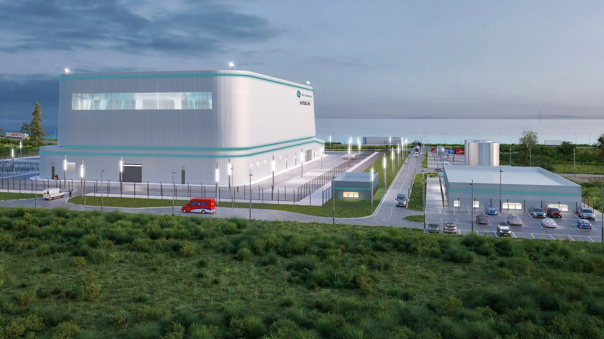

# Welcome to the 2026 Nuclear Innovation Challenge!

Created By: Engineering IDEAs Clinic Co-op Students

## Quick Links

# Your Mission

_Theme: Small Modular Reactors (SMRs)_  

As the technology advances to embrace Artificial Intelligence (AI), data centers have become massive energy consumption sinks. To provide the energy output demanded by data centers, alternative energy production frontiers need to be considered. Small Modular Reactors (SMRs) are at the forefront of this conversations, with multiple being developed to address these energy needs. The Darlington New Nuclear project is a SMR project currently in development in Ontario, marking the first SMR in the Western world. It began construction in May 2025, and is expected to finish in 2029. 

The Darlington project uses the GE Vernova Hitachi BWRX-300 boiling water reactor (BWR). The BWR uses nuclear fission to turn water into steam, which goes directly to a turbine to create electricity. The project is expected to create more than 18 000 jobs, add $38.5 Billion to Canada's GDP, and provide 1.2 Gigawatts of energy between the four planned units, supplying power to over a million homes. 

To find out more: [BWRX-300 SMR](https://www.gevernova.com/nuclear/carbon-free-power/bwrx-300-small-modular-reactor)

# Subproblems

## Controls and Instrumentation

Learn More: [Controls and Instrumentation Subproblem](/Controls%20and%20Intrumentation/)

## Leak Detection and Cleanup

**Potential Solutions:**

Learn More: [Leak Detection and Cleanup Subproblem](/Leak%20Detection%20and%20Cleanup/)

## Reactor Design Optimization

**Potential Solutions:**

Learn More: [Reactor Design Optimization Subproblem](/Reactor%20Design%20Optimation/)

## Security

**Potential Solutions:**

Learn More: [Security Subproblem](/Security/)

# Resources and Kits

Resources and Kit information can be found in the folders for the respective subproblem. 

To sign out a kit, go to the sign out table and speak to a coop. You will have to go through safety training for some of the kits.

# Presentation & Submission
Please find details about the rubric, presentation and submission [here](/Presentation%20&%20Submission/)

## Schedule
