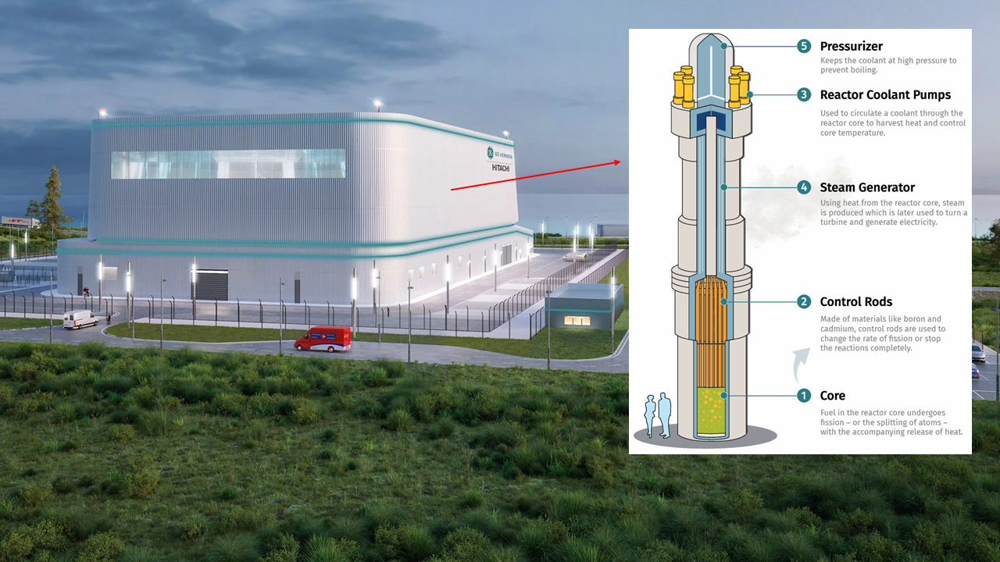

# Welcome to the 2026 Nuclear Innovation Challenge!

Created by Engineering IDEAs Clinic co-op students.

## Accessibility

This README uses descriptive headings, meaningful link names, short sections, and alt text for images so it is easier to navigate with screen readers and other assistive technologies. The challenge also welcomes accessible solutions that work for people with different needs and levels of technical experience.

## Table of Contents

- [Accessibility](#accessibility)
- [Quick Links](#quick-links)
- [Your Mission](#your-mission)
- [Sub-Problems](#sub-problems)
  - [Controls and Instrumentation](#controls-and-instrumentation)
  - [Leak Detection and Cleanup](#leak-detection-and-cleanup)
  - [Reactor Design Optimization](#reactor-design-optimization)
  - [Security](#security)
- [General Resources](#general-resources)
  - [Presentation and Submission](#presentation-and-submission)
  - [Judging Criteria](#judging-criteria)
  - [Schedule](#schedule)

## Quick Links

- [BWRX-300 Small Modular Reactor](https://www.gevernova.com/nuclear/carbon-free-power/bwrx-300-small-modular-reactor)
- [Controls and Instrumentation Subproblem](Controls%20and%20Instrumentation/)
- [Leak Detection and Cleanup Subproblem](Leak%20Detection%20and%20Cleanup/)
- [Reactor Design Optimization Subproblem](Reactor%20Design%20Optimization/)
- [Security Subproblem](Security/)

## Your Mission

_Theme: Small Modular Reactors (SMRs)_

As technology advances to embrace Artificial Intelligence (AI), data centres have become major energy consumers. To provide the energy output demanded by data centres, alternative energy-production options need to be considered. Small Modular Reactors (SMRs) are at the forefront of these conversations, with multiple designs being developed to address these energy needs. The Darlington New Nuclear Project is an SMR project under construction in Ontario and is expected to become the first grid-scale SMR in the G7. Construction began in May 2025, with completion expected by the end of the decade and connection to the electricity grid expected by the end of 2030.

The Darlington project uses the GE Vernova Hitachi BWRX-300 boiling water reactor (BWR). The BWR uses nuclear fission to turn water into steam, which goes directly to a turbine to create electricity. Construction of the four planned units is expected to create up to 18,000 jobs. Their construction, operation, and maintenance are expected to add $38.5 billion to Canada's GDP over 65 years. Together, the four units will provide 1,200 megawatts of electricity, enough to power approximately 1.2 million homes.

To find out more: [BWRX-300 SMR](https://www.gevernova.com/nuclear/carbon-free-power/bwrx-300-small-modular-reactor)

For a broader view of SMR design, see the [OECD-NEA SMR Dashboard](https://www.oecd-nea.org/upload/docs/application/pdf/2025-09/web_-_smr_dashboard_-_third_edition.pdf) and the [IAEA ARIS SMR Catalogue](https://aris.iaea.org/Publications/SMR_catalogue_2024.pdf). Both give a sense of the variety of SMR designs being developed internationally. You can find the BWRX-300 on page 134 of the OECD Dashboard and page 17 of the IAEA Catalogue.

---

## Sub-Problems

### Controls and Instrumentation

Modern energy systems rely on sensors, controllers, and safety systems to operate reliably. In nuclear power plants, instrumentation and control systems help monitor reactor power, temperature, coolant conditions, and control rod movement to keep the system stable and safe.

This challenge invites students to design a controller for a simplified SMR-inspired reactor simulation. Teams will try to make the reactor follow a requested power output while handling noisy sensors, disturbances, physical limits, and safety rules.

Students may also build a safe physical analogue system, such as a temperature controller, syringe pump, or water-flow controller, to demonstrate the same feedback control ideas in hardware.

| Engineering Perspective                                                                                                                                                                                                                                                                                                                                                                                                                         | Science Perspective                                                                                                                                                                                                                                                                                                                                                                                                                             |
| ----------------------------------------------------------------------------------------------------------------------------------------------------------------------------------------------------------------------------------------------------------------------------------------------------------------------------------------------------------------------------------------------------------------------------------------------- | ----------------------------------------------------------------------------------------------------------------------------------------------------------------------------------------------------------------------------------------------------------------------------------------------------------------------------------------------------------------------------------------------------------------------------------------------- |
| - Build a PID controller to track a target power level - Filter noisy sensor readings - Add safety logic for warnings, limits, SCRAM, or shutdown - Detect faults such as bad sensors, stuck actuators, or cooling problems - Create a dashboard to show power, temperature, control input, and safety state - Build a physical analogue such as a temperature control system, syringe pump, or peristaltic pump flow controller | - Build a PID controller to track a target power level - Filter noisy sensor readings - Add safety logic for warnings, limits, SCRAM, or shutdown - Detect faults such as bad sensors, stuck actuators, or cooling problems - Create a dashboard to show power, temperature, control input, and safety state - Build a physical analogue such as a temperature control system, syringe pump, or peristaltic pump flow controller |

#### Potential Solutions

- Build a PID controller to track a target power level
- Filter noisy sensor readings
- Add safety logic for warnings, limits, SCRAM, or shutdown
- Detect faults such as bad sensors, stuck actuators, or cooling problems
- Create a dashboard to show power, temperature, control input, and safety state
- Build a physical analogue such as a temperature control system, syringe pump, or peristaltic pump flow controller

Learn more in the [Controls and Instrumentation subproblem](Controls%20and%20Instrumentation/).

### Leak Detection and Cleanup

A big concern in any nuclear facility is quickly detecting leaks. SMRs face additional concerns compared to traditional reactors because of their different geometry and narrow form factor.

This challenge invites students to develop a system capable of autonomously detecting, localizing, and reporting radiation leaks in SMR facilities. Solutions may also include methods for monitoring contamination spread and supporting cleanup operations.

#### Potential Solutions

- Train an AI model to detect leaks from sensor data
- Use a simple containment structure with simulated vibrations (as a model for leaks) to localize their locations
- Create a digital mock-up of a nuclear facility and simulate a drone/robot patrolling the facility

Learn more in the [Leak Detection and Cleanup subproblem](Leak%20Detection%20and%20Cleanup/).

### Reactor Design Optimization

SMRs are a relatively new technology that have some advantages over traditional nuclear reactors, but also some disadvantages. A major part of designing SMRs is optimizing their design to minimize their disadvantages and maximize their advantages. There are many parts of a reactor that can affect efficiency, cost, and feasibility of the design. Reactor performance depends on design choices such as fuel rod geometry and material selection, and operating choices such as control rod movement, coolant flow, steam flow, and startup strategy.

This challenge invites students to use physics and engineering principles to model a reactor that is efficient, economical, and practical for deployment. Solutions should explore trade-offs among fuel design, reactor performance, lifecycle cost, and operational constraints. Teams may focus on reactor design optimization, reactor operation optimization, or a combination of both. The goal is to improve performance while considering safety limits, power output, fuel lifetime, cost, and overall system efficiency.

Participants are encouraged to build tools, simulations, dashboards, or algorithms that compare design choices, tune operating strategies, or automatically search for better solutions.

#### Potential Solutions

- Use the provided SMR Reactor Design Optimization Tool to set parameters and check the effects on the costs and efficiency of the reactor
- Develop an automated controller that reads the live state of a simulated reactor and adjusts control values to maximize efficiency
- Use optimization methods to improve startup, tracking, recovery, or design performance
- Create dashboards to compare reactor designs, simulator runs, costs, and performance metrics
- Log reactor data and analyze which design or control parameters affect performance most
- Research SMR design concepts and draft a proposal for a particular design

Learn more in the [Reactor Design Optimization subproblem](Reactor%20Design%20Optimization/).

### Security

Nuclear facilities are highly critical locations that require extremely strict security measures to prevent sabotage. Nuclear facilities integrate multi-layered security protocols and policies to protect the premises from bad actors. SMR facilities may need to diverge from the traditional reactor structure, which may introduce new security concerns.

This challenge asks teams to design access-control policies, detection strategies, and response workflows that safeguard vital areas, detect unauthorized removal of radiological material, and mitigate insider or external threats without causing excessive nuisance alarms or operational paralysis.

#### Potential Solutions

- Build a policy-simulation dashboard to design zones, access rules, and test adversary profiles
- Prototype NFC/RFID badge readers or physical access hardware with fail-secure mechanics
- Develop computer-vision intrusion/perimeter detection and alarm integration
- Optimize facility layout and add radiation portal monitoring at choke points to detect illicit material movement

Learn more in the [Security subproblem](Security/).

---

## General Resources

Resources and kit information can be found in the folder for each subproblem.

To sign out a kit, go to the sign-out table and speak to a co-op student. You will have to complete safety training for some of the kits.

### Presentation and Submission

Teams will give a short presentation of about 3 to 5 minutes. Include:

- the problem you chose and who it affects
- how your solution works
- the prototype, simulation, dashboard, research, or hardware demonstration
- the safety constraints and edge cases you considered
- the result you achieved
- what you would improve with more time

Your submission may include code, a dashboard, a simulation, a hardware and software demonstration, a design with partial implementation, a research-based proposal, or a combination of these.

### Judging Criteria

| Category | What judges are looking for |
| --- | --- |
| **Relevance and impact** | The solution addresses a meaningful problem related to SMRs and could help its intended users or stakeholders. |
| **Feasibility** | The idea, cost, assumptions, and implementation are realistic. |
| **Prototype execution** | The prototype, simulation, analysis, or demonstration works and is well made. |
| **Safety and technical understanding** | The team identifies important safety limits, failure modes, and relevant engineering principles. |
| **Demo and presentation** | The team explains the problem, decisions, trade-offs, and results clearly. |

### Schedule
