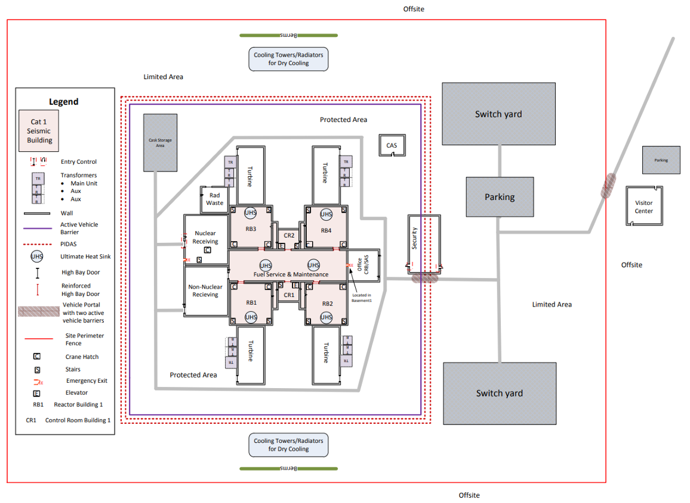

# Security

## Overview

Small Modular Reactors (SMRs) represent the next generation of nuclear energy, featuring compact designs, factory fabrication, and passive safety systems. However, their smaller physical footprints and potential deployment in remote or distributed locations introduce unique security challenges. A robust **Physical Protection System (PPS)** must safeguard the facility against radiological sabotage and the theft of sensitive materials while remaining operationally viable.

This subchallenge invites students to explore security policy design and access control architecture for SMR facilities. Solutions must balance security effectiveness against operational feasibility—a system that stops every threat but paralyzes daily operations is an engineering failure; conversely, a system that prioritizes convenience at the expense of security is a risk.

---

## Potential Solutions

Teams may approach this security challenge in several ways, depending on their background and interests:

- **Use the provided security simulation dashboard** to design zones and access-control policies for a fictional SMR facility, then test against various adversary profiles
- **Develop a computer vision system** to detect and alert on unauthorized personnel movement or intrusion attempts
- **Integrate RFID or NFC technology** to implement hardware-based access restrictions and audit trails
- **Design a physical facility layout** that optimizes defensibility, sightlines, and barrier placement more effectively than the baseline provided

The remainder of this README focuses on the **proposed dashboard-based solution**, which offers a structured, iterative learning path for teams interested in security policy and systems engineering. Teams pursuing other approaches are encouraged to explore those directions independently.

---

## Proposed Solution: Security Policy & Access Control Design

In this guided approach, you will act as a Lead Systems Security Engineer. Your objective is to design an access control policy and zone topography for a fictional SMR facility using an interactive dashboard interface. This challenge draws from real-world nuclear security frameworks established by the **Nuclear Regulatory Commission (NRC)** and the **International Atomic Energy Agency (IAEA)**. The facility you design will be a simplified version of real life nuclear facilities. See below for a model of what a real nuclear facility may look like from a security point-of-view:



### Challenge Objectives

To complete this solution path, you must configure the facility's security settings to accomplish the following:

* **Establish Security Zones:** Group the physical rooms of the facility into distinct, logical security perimeters based on risk and function.
* **Define Access Permissions:** Assign explicit clearance levels for every personnel role across each security zone.
* **Implement Conditional Controls:** Apply secondary security requirements where vulnerabilities exist (e.g., two-person rules, multi-factor authentication).
* **Configure State-Dependent Logic:** Program how access permissions dynamically modify when the facility transitions from Normal Operations to an Emergency/Alert State.
* **Provide Engineering Justification:** Defend your architectural decisions based on established nuclear security principles.

### Workflow

1. **Design Phase:** Use the dashboard to map rooms to zones and assign role clearances. The interface will save your progress directly to your local workspace files.
2. **Dynamic Scenario Phase:** The system will present real-world operational edge cases. You must evaluate how your programmed rules respond to these scenario injects.
3. **Simulation Phase:** Once finalized, run the simulation tool to subject your access policy to automated adversary testing profiles.
4. **Iterative Optimization:** Review the generated performance logs, identify vulnerabilities, adjust your configuration in the interface, and resubmit for evaluation.

---

## Environment & Materials

### Workspace File Structure

Your project directory contains the following configuration and documentation files:

```text
Security/
├── data/
│   ├── facility_blueprint.json   # Read-only physical layout and role requirements
│   └── policy_config.json        # Output file managed and updated by the interface
└── src/
    ├── blueprint_loader.py       # Utility to load facility data
    ├── policy_manager.py         # Policy configuration and validation
    ├── guardrails.py             # Security rule enforcement
    └── graph_engine.py           # Facility topology and access-path analysis

```

### What is Provided

* **Facility Blueprint Data:** A layout mapping the physical rooms, structural doors, and directional connections of the SMR facility.
* **Personnel Profiles:** Operational definitions for six core facility roles (Reactor Operator, Security Officer, Maintenance Technician, Contractor, Visitor, and Emergency Responder).
* **Core Mission Requirements:** The baseline rooms each personnel role must be capable of reaching to execute their mandatory daily duties.
* **Dashboard Interface & Policy Engine:** Tools to design zones, define access rules, and test policies against simulated adversary scenarios.

### What Needs to Be Submitted

1. **`policy_config.json`:** The finalized permission matrix and zone topography exported via the graphical interface.
2. **`justification.md`:** A completed engineering report defending your design choices, zone boundaries, state-dependent logic, and responses to test scenarios.

---

## Evaluation Criteria

Your submission will be automatically evaluated across three core engineering metrics:

| Metric | Evaluation Focus |
| --- | --- |
| **Security Effectiveness** | The defensive capability of your policy when evaluated against automated adversary simulation profiles. |
| **Operational Feasibility** | The structural viability of your layout. Personnel must be able to perform required duties without systemic deadlock. |
| **Architectural Rigor** | The technical validity and depth of your engineering justifications in the submitted design documentation. |

---

## Recommended Roadmap

Teams are encouraged to take the project in any direction. These milestones are not requirements or a scoring checklist; they are simply guides and pathways to help teams in building their solutions.

### Milestone 1: Understand the Facility Layout

Goal: familiarize yourself with the physical blueprint and personnel roles.

Suggested outcomes:

- Load and visualize the facility blueprint
- Identify all physical rooms and structural connections (doors, corridors)
- Review the six personnel roles and their core mission requirements
- Trace at least one valid access path from entry to a critical area for each role

Good demo: you can explain the facility layout to a team member and describe which roles need to reach which areas.

### Milestone 2: Design an Initial Zone Topology

Goal: group rooms into logical security perimeters and assign preliminary zone-based permissions.

Suggested outcomes:

- Create a zone topology (e.g., Public, Controlled, Restricted, Vital Areas)
- Map each physical room to exactly one zone
- Assign clearance levels for each role in each zone (Deny, Grant, Grant-with-Conditions)
- Verify that each role can still reach its mission-critical areas
- Test a simple normal-operations scenario

Good demo: you can show the dashboard with a clean zone layout and explain why each zone exists and which roles require access.

### Milestone 3: Apply Defense-in-Depth Principles

Goal: strengthen the policy by adding conditional controls and multi-factor requirements.

Suggested outcomes:

- Identify vulnerable transitions or choke-points in the facility
- Add two-person rules, time-windows, or audit requirements to high-risk zones
- Implement the Principle of Least Privilege (grant only minimum access needed)
- Apply the Detection-Delay-Response triad concepts (e.g., logging, physical barriers, response procedures)
- Test your enhanced policy against a few adversary scenarios

Good demo: you can articulate which security principles you applied and why they reduce risk.

### Milestone 4: Design State-Dependent Logic

Goal: adapt access permissions when the facility moves from Normal Operations to Emergency or Alert states.

Suggested outcomes:

- Define how each role's permissions change during an emergency (lockdown, evacuation, shelter-in-place, etc.)
- Add logic to grant Emergency Responders additional access while restricting others
- Ensure critical operations personnel can still perform life-safety functions
- Test transitions between operational states

Good demo: the system correctly grants and revokes access as the operational state changes, and personnel can still reach critical resources.

### Milestone 5: Evaluate Against Adversary Scenarios

Goal: expose vulnerabilities by testing your policy against simulated attackers and operational edge cases.

Suggested outcomes:

- Run the policy through the simulation tool with various threat profiles
- Review the generated performance logs to identify failed access denials or critical-role blockages
- Identify the trade-offs your design makes (e.g., speed vs. security, convenience vs. assurance)
- Compare your results to baseline or reference policies

Good demo: you can interpret the simulation results and explain which scenarios were defended well and which revealed design gaps.

### Milestone 6: Refine and Document Your Design

Goal: finalize your policy and create a rigorous engineering justification.

Suggested outcomes:

- Refine zone boundaries, permissions, and conditional rules based on simulation feedback
- Write a comprehensive justification document that covers:
  - Your zone topology and rationale
  - Access permission matrix and assumptions
  - State-dependent logic and emergency procedures
  - Trade-offs between security and operational efficiency
  - How your design addresses real-world security concepts (Defense-in-Depth, DBT, VAI, Least Privilege, etc.)
- Include example scenarios and how your policy responds
- Create clear diagrams or visualizations of your final design

Good demo: a teammate or reviewer can read your justification and understand why your design is effective and operationally sound.

---

## Recommended Research Concepts

To maximize the effectiveness of your design, it is highly recommended to research the following nuclear industry security concepts before beginning construction:

* **Defense-in-Depth (Physical Application):** Multiple independent layers of protection, so that no single point of failure compromises security.
* **Design Basis Threat (DBT):** A formal characterization of the adversary (skills, capabilities, resources, intent) against which the facility must defend.
* **Vital Area Identification (VAI):** Systematic identification of areas or assets whose compromise could enable radiological sabotage or theft.
* **The Principle of Least Privilege:** Each role receives the minimum access necessary to perform its function, no more.
* **The Detection, Delay, and Response Triad:** Defense strategy combining early detection of intrusion attempts, physical/administrative delay to slow an adversary, and response procedures.
* **Two-Person Rule (M-of-N Authentication):** Requirement that critical actions are authorized by two or more independent personnel, reducing insider-threat risk.
* **Access Control List (ACL) Fail-Secure Mechanics:** Ensuring that access control systems default to denial ("fail closed") rather than granting access in case of component failure or attack.
