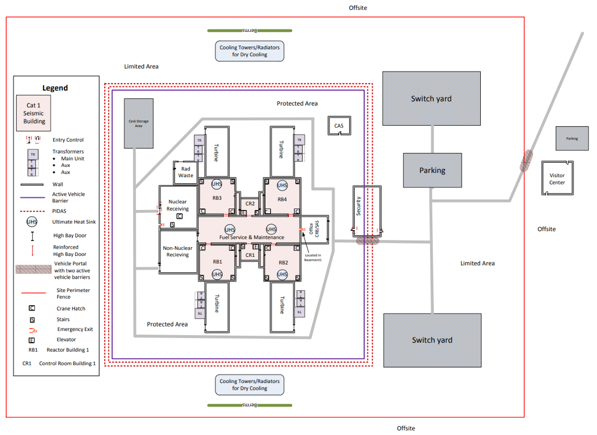

# SMR Security Challenge

## Table of Contents
- [Quick Links](#quick-links)
- [Your Mission](#your-mission)
- [Sub-Problems](#sub-problems)
  - [Security Policy & Access Control Design](#security-policy--access-control-design)
- [General Resources](#general-resources)

## Quick Links
> **Navigation Tip:** Use the headings in this document to quickly navigate between sections. Screen reader users can move through the document by heading level.

- [Submission Instructions]
- [Judging Rubric]
- [Proposed Solution Walkthrough](policy_simulation/README.md)

## Your Mission

Small Modular Reactors (SMRs) represent the next generation of nuclear energy, featuring compact designs, factory fabrication, and passive safety systems. However, their smaller physical footprints introduce unique security challenges.

Your task is to design a **Physical Protection System (PPS)** that safeguards a fictional SMR facility against radiological sabotage and the theft of sensitive materials, while remaining operationally viable. Solutions must balance security effectiveness against operational feasibility: a system that stops every threat but paralyzes daily operations is an engineering failure, while a system that prioritizes convenience at the expense of security is a risk.

This challenge draws from real-world nuclear security frameworks established by the **Nuclear Regulatory Commission (NRC)** and the **International Atomic Energy Agency (IAEA)**. The facility you design will be a simplified version of a real nuclear facility.

## Sub-Problems

### Security Policy & Access Control Design

A robust PPS can be approached in several ways, depending on your team's background and interests:

#### Challenge A: Software-Based Policy Simulation
Design zones and access-control policies for a fictional SMR facility using the provided security simulation dashboard, then test your policy against several simulated adversary profiles.

#### Challenge B: Physical Access Hardware
Build and wire a physical NFC badge-reader circuit, flash its firmware, and verify live badge transit through the facility in real time.

#### Challenge C: Alternative Approaches
If your team's interests lie elsewhere, you may instead:
- Develop a computer vision system to detect and alert on unauthorized personnel movement or intrusion attempts.
- Design a physical facility layout that optimizes defensibility, sightlines, and barrier placement more effectively than the provided baseline.

Challenges A and B can be completed independently or combined into a single project. For a full step-by-step guide covering both tracks — including environment setup, the execution roadmap, and submission requirements — check out the [Proposed Solution Walkthrough](policy_simulation/README.md).

## General Resources

To maximize the effectiveness of your design, research the following nuclear industry security concepts. These apply regardless of which approach your team chooses:

- **Defense-in-Depth (Physical Application):** Multiple independent layers of protection so that no single point of failure compromises security.
- **Design Basis Threat (DBT):** A formal characterization of the adversary (skills, capabilities, resources, intent) against which the facility must defend.
- **Vital Area Identification (VAI):** Systematic identification of areas or assets whose compromise could enable radiological sabotage or theft.
- **The Principle of Least Privilege:** Each role receives the minimum access necessary to perform its function, no more.
- **The Detection, Delay, and Response Triad:** A defense strategy combining early detection of intrusion attempts, physical/administrative delay to slow an adversary, and response procedures.
- **Two-Person Rule (M-of-N Authentication):** A requirement that critical actions be authorized by two or more independent personnel, reducing insider-threat risk.
- **Access Control List (ACL) Fail-Secure Mechanics:** Ensuring that access control systems default to denial ("fail closed") rather than granting access in case of component failure or attack.