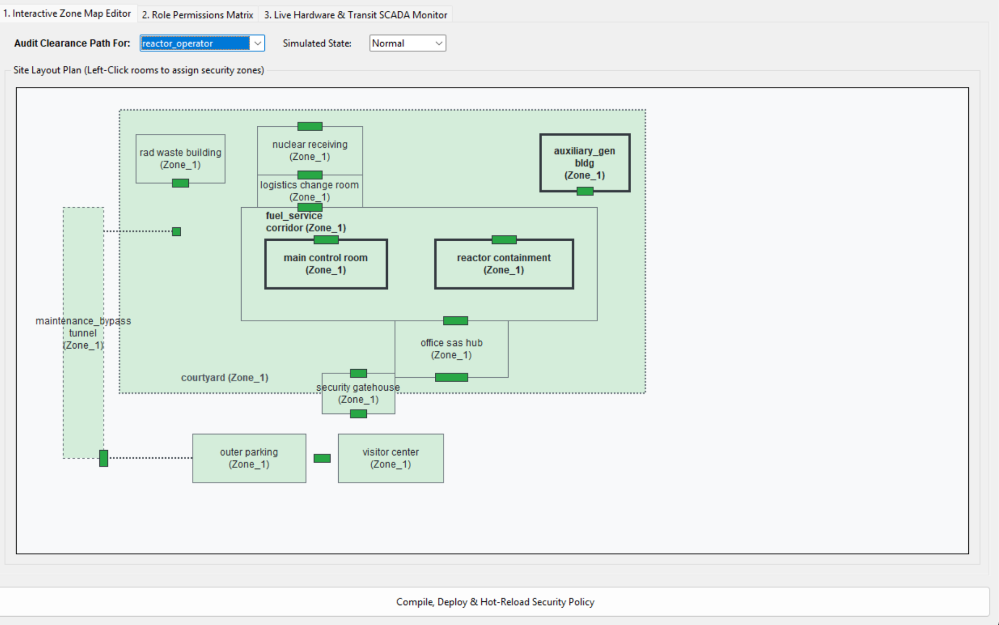
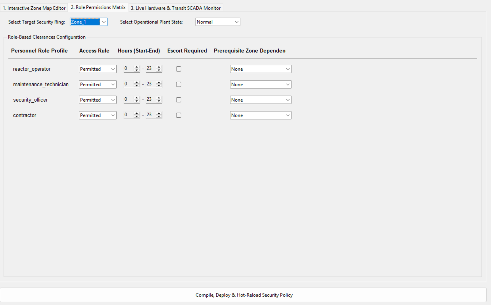
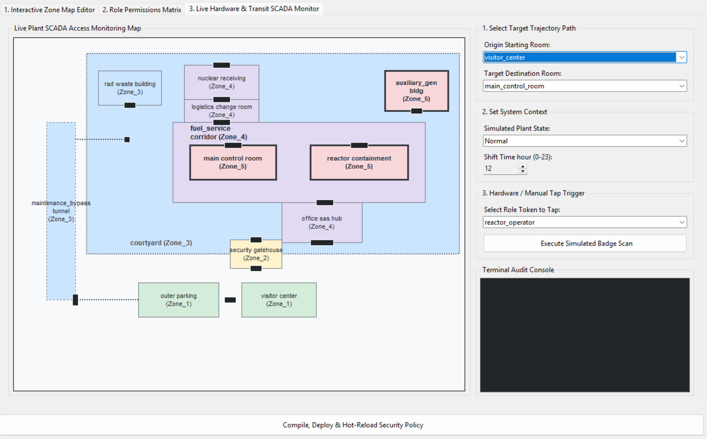

# Security Policy Simulation Solution

## Overview

In this approach, you will act as a member of the Systems Security team. The challenge is split into two parts. Depending on your team's focus and interests, you can choose to complete Part 1, Part 2, or both:

- **Systems Track (Part 1 Only):** Focus on security policy architecture, zone topology, and defeating simulated adversary attacks. Test your policy using the software-based badge emulator built into the dashboard.
- **Hardware Track (Part 2 Only):** Focus on building the physical NFC reader circuit, flashing firmware, and verifying live transit. Use the ready-to-test default policy configuration provided in the workspace without designing a policy from scratch.
- **Combined Track:** Design a custom security framework, deploy it to memory, and physically tap NFC badges on your Arduino circuit to grant or deny access in real time.

## Execution Roadmap & Tutorial

You may follow these milestones to complete your project. Depending on your chosen track, you can complete Phase 1–3 (Software), Phase 4–5 (Hardware), or the entire roadmap.

```text
+-----------------------------------------------------------------------------------+
|                            PROJECT EXECUTION ROADMAP                              |
+-----------------------------------------------------------------------------------+
|  [Phase 1] Facility Orientation & Environment Setup                               |
|       │                                                                           |
|       ├──────────────► [SOFTWARE TRACK]                                           |
|       │                [Phase 2] Policy Architecture & Matrix Design (Part 1)     |
|       │                [Phase 3] Adversary Simulation & Iterative Tuning (Part 1) |
|       │                                                                           |
|       └──────────────► [HARDWARE TRACK]                                           |
|                        [Phase 4] Breadboard Wiring & Firmware Upload (Part 2)     |
|                        [Phase 5] Physical NFC Tap Verification & SCADA (Part 2)   |
|                                                                                   |
|  [Phase 6] System Documentation & Final Submission                                |
+-----------------------------------------------------------------------------------+
```

### Phase 1: Facility Orientation & Setup

**Goal:** Understand the 13-room SMR layout, personnel roles, and mission requirements.

**Steps:**
1. Inspect `data/facility_blueprint.json` to review room connections, vital assets (`main_control_room`, `reactor_containment`), and subterranean shortcut tunnels. 
2. Install required dependencies:
```bash
pip install pyserial
```
   - **Note for Linux/macOS users:** You may also need to install `tkinter` separately:
     - Ubuntu/Debian: `sudo apt-get install python3-tk`
     - macOS: `brew install python-tk@3.x` (replace x with your Python version)
     - Windows: `tkinter` is included by default
3. Launch the unified security terminal from the Security/policy_simulation folder:
```bash
python src/dashboard.py
```
4. Explore the default layout in Tab 1 (Interactive Zone Map Editor). The interface should look like the following:



### Phase 2: Security Policy Architecture & Matrix Design (Part 1 - Systems Track)

**Goal:** Design a resilient access control policy and zone topography using the dashboard.

**Steps:**
1. **Map Security Zones (Tab 1):** Click on rooms on the 2D floor plan to group them into logical security rings (`Zone_1` through `Zone_5`).
2. **Configure Permissions Matrix (Tab 2):** Change the tab to Tab 2 (Role Permissions Matrix). This tab is for setting permissions for the different roles:



   Define the role clearances (`Permitted`, `Restricted`, `Denied`), operational time windows, and prerequisite zone dependencies (e.g., mandating prior clearance of `Zone_2` before entering higher zones) within this tab. Remember to set permissions for both normal and emergency states, as they are completely separate policies.
3. **Deploy & Hot-Reload:** Click **"Compile, Deploy & Hot-Reload Security Policy"** at the bottom of the screen. This exports [`data/policy_config.json`](data/policy_config.json) and immediately reloads the policy engine in memory.

### Phase 3: Adversary Simulation & Policy Refinement (Part 1 - Systems Track)

**Goal:** Repel four automated attackers while maintaining operational feasibility.

**Steps:**
1. Run the automated threat evaluation suite in your terminal:
```bash
python src/evaluate_policy.py
```
2. Review the generated scorecard for the four adversary profiles:
   - **Social Engineer:** Probes for perimeter fractures where personnel drop into lower zones mid-transit.
   - **Impersonator:** Tests unescorted contractor access during security guard distraction/saturation.
   - **Insider:** Attempts unauthorized lateral sweeps into vital areas outside mandatory job scope.
   - **Emergency Exploiter:** Checks if emergency state rules cause systemic deadlocks or critical response delays.
3. Refine your policy matrix in the dashboard to eliminate vulnerabilities, re-deploy, and run `evaluate_policy.py` until all attacks are repelled and operational efficiency is verified.

*(Note for Systems-Only students: This marks the end of Part 1. However, you can still test Tab 3 without completing the hardware setup. Swap to Tab 3 and set up the conditions for traversal. Then, instead of tapping the badge on the hardware setup, you can simulate a tap using the "Execute Simulated Badge Scan" button).*

### Phase 4: Hardware Assembly & Firmware Flash (Part 2 - Hardware Track)

**Goal:** Assemble the physical NFC verification terminal using an Arduino Uno R4 and RC522 module.

**Steps:**
1. **Wire the Circuit:**
   - **Power:** Connect RC522 `3.3V` → Arduino `3.3V` (*Strictly 3.3V — do NOT connect to 5V!*)
   - **Ground:** Connect RC522 `GND` → Arduino `GND`
   - **SPI Bus:** Connect `SDA` → Pin 10, `MOSI` → Pin 11, `MISO` → Pin 12, `SCK` → Pin 13, `RST` → Pin 9
2. **Flash Firmware:**
   - Open `src/firmware.ino` in the Arduino IDE.
   - Install the `MFRC522` library (by GithubCommunity) via the Library Manager.
   - Upload the sketch to your Arduino Uno R4.

### Phase 5: Live Physical Verification & SCADA Integration (Part 2 - Hardware Track)

**Goal:** Tap physical NTAG215 cards to trigger live Dijkstra pathfinding and breadboard LED actuation.

**Steps:**
1. **Discover Card UIDs:** Scan your physical NTAG215 badges to obtain their 7-byte hexadecimal UIDs (e.g., `04:3E:5B:A2:91:5D:80`). The UIDs will be output in the Serial Monitor of the Arduino IDE.
2. **Register Badges:** Update the `NFC_REGISTRY` dictionary inside `src/dashboard.py` with your card UIDs and assigned roles. Close the Serial Monitor in Arduino IDE after pasting the UIDs.
3. **Run Live Terminal:** Launch `python src/unified_dashboard.py` and switch to **Tab 3 (Live Hardware & Transit SCADA Monitor)**.

   *(Note for Hardware-Only students: The system automatically loads a ready-to-test default policy configuration so you can scan immediately without completing Part 1).*

   The tab will look like this:



   You can configure the starting room, destination room, plant state, and time before tapping the badge.
4. **Tap Badges:** Tap an NTAG215 card on the RC522 reader. The app evaluates the path using Dijkstra's algorithm and draws the route on the 2D SCADA map.

### Phase 6: System Documentation & Final Submission

**Goal:** Document engineering rationale and submit final deliverables.

**Steps:**
1. Ensure `data/policy_config.json` reflects your finalized configuration.
2. Complete `justification.md` to defend your zone boundaries, state-dependent logic, defense-in-depth principles, and hardware implementation choices.

## Environment & Materials

### Workspace File Structure

Your project directory contains the following configuration and source files:

```text
Security/
├── policy_simulation/
│   ├── data/
│   │   ├── facility_blueprint.json   # Read-only physical layout and role requirements
│   │   └── policy_config.json        # Output policy file managed by the dashboard
│   └── src/
│       ├── dashboard.py              # Master application (Zone Editor, Matrix, SCADA Hardware)
│       ├── evaluate_policy.py        # Automated adversary simulation test
│       ├── firmware.ino              # Arduino Uno R4 / RC522 SPI firmware
│       ├── hardware_bridge.py        # Standalone terminal serial bridge
│       ├── blueprint_loader.py       # Blueprint JSON parser & graph loader
│       ├── policy_manager.py         # Multi-state security policy evaluator
│       ├── graph_engine.py           # Dijkstra pathfinding & time-cost engine
│       ├── guardrails.py             # Operational feasibility auditor
│       └── attackers.py              # Adversary threat profiles (Social Engineer, Insider, etc.)
```

### What is Provided

- **Facility Blueprint Data:** A layout mapping physical rooms, structural doors, and directional connections for the 13-room SMR facility.
- **Pre-Built Baseline Policy:** A ready-to-test `policy_config.json` that allows hardware-focused teams to run physical tests out of the box.
- **Unified Graphical Terminal:** An all-in-one application providing interactive zone mapping, permissions matrix editing, software badge simulation, and live serial hardware bridging.
- **Automated Threat Simulator:** An evaluation script that subjects access policies to active adversary attacks and operational guardrails.

### What Needs to Be Submitted

1. **`policy_config.json`:** Your finalized permission matrix and zone topography exported via the graphical interface.
2. **`justification.md`:** A completed engineering report defending your design choices, zone boundaries, state-dependent logic, hardware implementation (if completed), and responses to test scenarios.

## Opportunities for Innovation

This solution establishes a strong foundation for access control, policy design, adversary testing, and hardware-enabled verification. However, to cover the scientific judgement component of the rubric, you can focus on more advanced safety and consequence-informed decision support.

Potential innovation directions include:

- Linking badge movement decisions to radiological source-term or dose-based reasoning, such as identifying whether a person or package is moving through a contamination boundary or into an area that should be constrained for dose or shielding reasons.
- Integrating reactor-state science into the access-control logic, so plant conditions, system faults, and emergency operating modes can influence how security decisions are interpreted and prioritised.
- Introducing a scientific decision layer that connects policy enforcement to measurable reactor safety indicators, material inventory, radiological spread, and safety-margin assumptions.

Taken together, these opportunities would allow the current engineered security model to evolve into a science-informed safety and risk model that better connects operational access control with nuclear consequence assessment.
